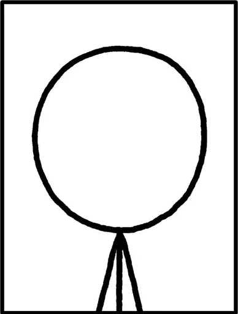

## Introduction

 I am first year student in [Linquistic Diversity and Digital Humantities master's programme](https://www.helsinki.fi/en/degree-programmes/linguistic-diversity-and-digital-humanities-masters-programme/studying) (LingDig) in University of Helsinki. For my study track I chose [cognitive science](https://www.helsinki.fi/en/faculty-arts/research/disciplines/digital-humanities/cognitive-science). I got to know the field when I had cognitive science as my minor when completing my bachelors degree in computer science and fell in love with the interdisciplinary nature of the discipline.

What else was I suppose to write... Hobbies? As I am a bit oder the the average student, I have a day job and two kids, so I don't have a lot of time for hobbies. I try to make use of commuting time by listening audio books and right now I am listening this: [Amanda Montells Cultish: The Language of Fanaticism](https://www.goodreads.com/book/show/55338982-cultish). 

Here's a list of few of my book recommendations: 
* [Kevin Mitnics & William L. Simon: Ghost in the Wires: My Adventures as the World's Most Wanted Hacker](https://www.goodreads.com/book/show/10256723-ghost-in-the-wires?ref=nav_sb_ss_1_18)
* [Oliver Sacks: The Man Who Mistook His Wife for a Hat and Other Clinical Tales](https://www.goodreads.com/book/show/63697.The_Man_Who_Mistook_His_Wife_for_a_Hat_and_Other_Clinical_Tales?ref=nav_sb_ss_1_24)
* [Terry Pratchett: Monstrous Regiment](https://www.goodreads.com/book/show/34511.Monstrous_Regiment?ac=1&from_search=true&qid=bXKHwntRTR&rank=1)
* [Terry Pratchett, Neil Gaiman: Good Omens: The Nice and Accurate Prophecies of Agnes Nutter, Witch](https://www.goodreads.com/book/show/12067.Good_Omens?from_search=true&from_srp=true&qid=E3jibDoW7X&rank=2)

---

This page is the final project of Command-Line Tools for Linguists course (University of Helsinki). The learning objectives in this course are:
* operating in a Unix-like environment
* using Unix command-line on a Windows or Mac OSX computer
* using regular expressions
* processing corpora at a basic level
* running programs from the command-line
* installing programs
* writing basic scripts
* using version control tools
* working on a remote server
* creating and hosting a webpage on GitHub Pages

If you are interested, see [this link](https://studies.helsinki.fi/courses/course-unit/otm-92ee484e-456b-409f-a397-d9d2b6e40a2f/KIK-LG221) to read more abut this course.

(_The source for the cartoon: _ -->)

## My notes from this course

[My notes collection](https://katja-cmd.github.io/cmdline_course.html)

## My cv
[My cv](https://katja-cmd.github.io/cv.html)

## Find me on

[GitHub](https://github.com/katja-cmd)

[Email me](mailto:katja.kvintus@helsinki.fi)

## My projects

* [Jakaja application for small group assignment optimization ror the University of Helsinki's Faculty of Education](https://github.com/piryopt/pienryhmien-optimointi). Study project for [Software Lab course](https://studies.helsinki.fi/kurssit/opintojakso/otm-f07aa52f-df4c-4a9a-8e89-d6222b88e2f2/TKT20007). Group work.

* [Movie voting app](https://github.com/KatjaKvintus/Movie-voting-app). Course project for [Software Development Methods course](https://studies.helsinki.fi/courses/course-unit/hy-CU-118024742-2021-08-01/TKT20002).

* [Overnight oatmeal recipe bank](https://github.com/KatjaKvintus/Overnight-oats-recipe-bank). Study project for [Database application lab course](https://studies.helsinki.fi/courses/course-unit/hy-CU-118025659-2021-08-01/TKT20011).

* [Visualization and comparison of maze generating algorithms ](https://github.com/KatjaKvintus/maze_generation). Study project for [Data Structures Project course](https://studies.helsinki.fi/courses/course-unit/hy-CU-118025627-2021-08-01/TKT20010).

* [This web page Github project](https://github.com/katja-cmd/katja-cmd.github.io). Study project for [Command Line Tools for Linguists course](https://studies.helsinki.fi/courses/course-unit/otm-92ee484e-456b-409f-a397-d9d2b6e40a2f).

## Few courses I've Taken

* [Introduction to Linquistic DIversity and Digital Humanties](https://studies.helsinki.fi/kurssit/toteutus/hy-opt-cur-2425-9df97501-21e6-4b8d-9de4-e91303f2ff71/LDA-301), fall 2024

* [Ethics of artificiall intelligence](https://studies.helsinki.fi/kurssit/toteutus/hy-opt-cur-2324-e5f774f1-ddd7-4890-be4f-d9501d462795/LDA-C505), spring 2024

* [Philosophy of Artificial Intelligence](https://studies.helsinki.fi/kurssit/toteutus/hy-opt-cur-2324-9fbc2bee-b638-41ea-ac53-35dc54b1515a/LDA-C307), spring 2024

* [Johdatus digitaalisiin ihmistieteisiin](https://studies.helsinki.fi/kurssit/toteutus/hy-opt-cur-2324-3cd28bb6-ab6b-45d1-859e-d4c4b55535d3/KIK-417/Johdatus_digitaalisiin_ihmistieteisiin_KIK_417_HISK_234_KUKA_501_TTK_MU221_TTK_MU251_Et%C3%A4opetus), spring 2024

* [Johdatus sosiaalitieteisiin](https://studies.helsinki.fi/kurssit/toteutus/otm-3efa51b5-cc9b-4be6-ab84-972b525252d9/SOSK-101), spring 2024

## My AI and CS favorites in the pop culture

* [Discworld: Hex](https://discworld.fandom.com/wiki/Hex) 

* [The Matrix](https://www.imdb.com/title/tt0133093/)

* [Marvin, the paranoid android](https://en.wikipedia.org/wiki/Marvin_the_Paranoid_Android)

* [Poe, the AI with a gaming adiction](https://altered-carbon.fandom.com/wiki/Poe)
